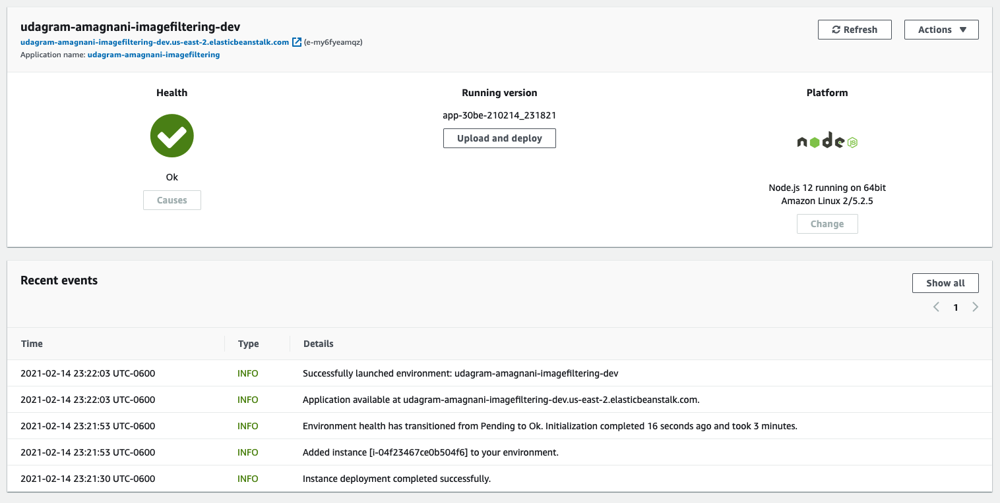

# Udagram Image Filtering Microservice

Udagram is a simple cloud application developed alongside the Udacity Cloud Engineering Nanodegree. It allows users to register and log into a web client, post photos to the feed, and process photos using an image filtering microservice.

This repository host image filtering microservice code.


### Prerequisits 

1. Node JS - version 12 LTE 
2. Elastic Beanstalk command line interface (CLI) to deploy in AWS Elastic Beanstalk. [Docs.](https://docs.aws.amazon.com/elasticbeanstalk/latest/dg/eb-cli3.html)
3. AWS Account

### Setup Node Environment

1. Initialize a new project: `npm i`
2. run the development server with `npm run dev`

### Endpoints

- Endpoint to filter an image from a public url.  
`filteredimage?image_url=<pass a image url>`
  - `image_url` URL of a publicly accessible image
  - Responses: 
    - `200`: the filtered image file
    - `422`: error message 

### Deploying your system

To deploy the microservice using AWS Elastic Beanstalk follow the process:
1. Run `eb init` to create a new application.
   - use us-east-2 (to avoid loadbalancer issues) 
   - application name: udagram-amagnani-imagefiltering
   - Node.js 12 running on 64bit Amazon Linux 2
   - Add the following to .elasticbeanstalk/config.yaml
     ```
     deploy:
      artifact: ./www/Archive.zip
     ```
2. Run `npm run build`
3. Rub `eb create` to create a new environment to deploy your image-filter service.
   - Use dev environment
   - load balancer type `application`
4. Use `eb deploy` to push changes.



### Test Domain Name

[http://udagram-amagnani-imagefiltering-dev.us-east-2.elasticbeanstalk.com/filteredimage?image_url=https://upload.wikimedia.org/wikipedia/commons/b/bd/Golden_tabby_and_white_kitten_n01.jpg](http://udagram-amagnani-imagefiltering-dev.us-east-2.elasticbeanstalk.com/filteredimage?image_url=https://upload.wikimedia.org/wikipedia/commons/b/bd/Golden_tabby_and_white_kitten_n01.jpg)

### Custom Domain Name

[http://imagefiltering.alemag1986.com](http://imagefiltering.alemag1986.com)
